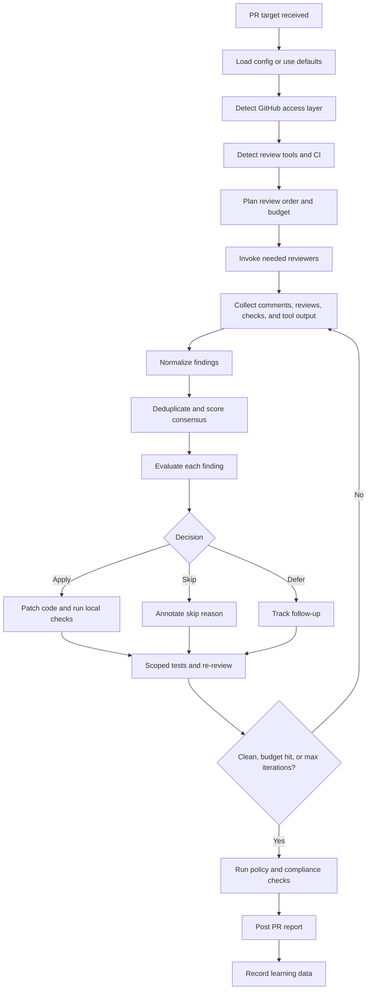
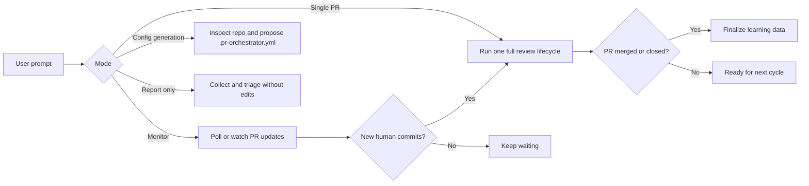

# PR Orchestrator

PR Orchestrator is a portable AI-agent skill for managing the full lifecycle of a GitHub pull request review. It detects available review tools, invokes them where appropriate, collects every finding, triages the results, applies or recommends fixes according to an autonomy policy, re-runs verification, posts a final report, and records outcome data so future reviews get faster and more accurate.

This is a skill, not a standalone binary. The core operating instructions live in [SKILL.md](./SKILL.md), and detailed references live in [references/](./references/). Point an agent at the skill and give it a PR target; the agent follows the workflow using the tools available in its environment.

## What It Does

PR Orchestrator turns a pull request into a managed review cycle:

- Discovers review tools such as CodeRabbit, Codex, Jules, Gemini Code Assist, Qodo PR-Agent, Graphite Agent, and Reviewdog.
- Uses the best available GitHub access layer: MCP connector, `gh` CLI, then direct REST API fallback.
- Invokes reviewers in a cost-aware order, avoiding duplicate or unnecessary runs.
- Collects findings from review comments, issue comments, check runs, and tool output.
- Normalizes, deduplicates, and scores findings using cross-tool consensus.
- Evaluates each finding for accuracy, applicability, PR scope, and implementation risk.
- Applies fixes when allowed by config, or asks for approval when required.
- Re-runs only the necessary reviewers and tests after changes.
- Checks project policy files such as `claude.md`, `agents.md`, `CONTRIBUTING.md`, and configured compliance domains.
- Posts a structured PR report and optionally writes a local report.
- Records learning data about tool precision, false positives, cost, and review outcomes.

## Current Status

The skill is in development. The workflow, configuration schema, report templates, and reference material are present. The TODO list tracks validation, action-wrapper work, monitoring improvements, and learning-system polish in [TODO.md](./TODO.md).

Use it today as an agent workflow: load the skill in Claude Code, Codex CLI, Cursor, Gemini, or another AI coding environment that can read the repository, use GitHub, and run shell commands.

## Contents

- [What It Does](#what-it-does)
- [How It Works](#how-it-works)
- [When To Use It](#when-to-use-it)
- [Requirements](#requirements)
- [Using The Skill](#using-the-skill)
- [Quick Start](#quick-start)
- [Prompt Variables And Steering](#prompt-variables-and-steering)
- [Configuration](#configuration)
- [Review Tool Integrations](#review-tool-integrations)
- [Outputs](#outputs)
- [Safety And Guardrails](#safety-and-guardrails)
- [Recommended Team Setup](#recommended-team-setup)
- [Roadmap Suggestions](#roadmap-suggestions)

## How It Works



### Operating Modes



### Autonomy Decision Model

```mermaid
flowchart TD
    A[Finding] --> B[Read relevant code and tests]
    B --> C{Accurate?}
    C -->|No| D[Skip and annotate false positive]
    C -->|Partially| E[Constrain or defer]
    C -->|Yes| F{Applicable to this repo?}
    F -->|No| G[Skip and cite project pattern]
    F -->|Yes| H{Worth fixing in this PR?}
    H -->|No| I[Defer to issue or human owner]
    H -->|Yes| J{Autonomy mode}
    J -->|full| K[Apply fix]
    J -->|approve-high-risk| L{High risk?}
    J -->|approve-all| M[Propose fix only]
    L -->|No| K
    L -->|Yes| M
    K --> N[Verify and annotate result]
    M --> O[Ask for approval]
```



## When To Use It

Use PR Orchestrator when you want an agent to coordinate a pull request review rather than run a single reviewer in isolation.

Good fits:

- A PR has multiple automated reviewers and the comments need triage.
- You want CodeRabbit, Codex, Jules, Gemini, or Reviewdog output consolidated into one decision table.
- You need an agent to decide which findings are real before editing code.
- You want approval gates for risky changes.
- You want to keep review cost under control.
- You need a final PR comment that explains what was fixed, skipped, deferred, and verified.
- You want repeatable review behavior across Claude Code, Cursor, Codex CLI, and Gemini.

Poor fits:

- You only need a quick local lint run.
- You want a human review replacement with no maintainer oversight.
- You need legal advice. The compliance checks are awareness flags only.
- You need a packaged GitHub Action today. That is planned, but not implemented in this repo yet.

## Requirements

At minimum:

- A GitHub pull request target.
- Repository checkout or API access.
- One GitHub access method:
  - MCP GitHub connector, preferred when available.
  - Authenticated `gh` CLI.
  - `GITHUB_TOKEN` for direct REST API fallback.

Optional but useful:

- Installed or configured review tools, such as CodeRabbit, Codex, Jules, Gemini Code Assist, PR-Agent, Graphite, or Reviewdog.
- Local test and lint commands.
- Repository policy files such as `claude.md`, `agents.md`, `CONTRIBUTING.md`, or `SECURITY.md`.
- A `.pr-orchestrator.yml` file for explicit steering.

## Using The Skill

Load [SKILL.md](./SKILL.md) into the agent environment, then provide a PR target and steering instructions. The README is for humans; `SKILL.md` is the compact runtime instruction file the agent should follow.

Common ways to use it:

- Claude Code or Cowork: install or reference the skill directory, then ask for a PR review workflow.
- Codex CLI: run from a checked-out repository and reference `pr-orchestrator/SKILL.md` in the prompt or skill context.
- Cursor: point the agent at this skill directory and the target repository.
- Gemini or another CLI-capable agent: include `SKILL.md` plus only the reference files needed for the requested workflow.

Steering priority:

1. Explicit instructions in the user prompt.
2. A config path named in the prompt or `PR_ORCHESTRATOR_CONFIG`.
3. `.pr-orchestrator.yml` in the repository root.
4. Auto-detected defaults.

## Quick Start

Give the agent a PR and the level of authority it should have:

```text
Use the pr-orchestrator skill on PR #42 in owner/repo.
Autonomy: approve-high-risk.
Review tools: auto-detect.
Focus: correctness, security, and test coverage.
Budget: 20 GitHub Actions minutes.
Post the final summary to the PR and write a local report.
```

For an annotate-only pass:

```text
Use pr-orchestrator on https://github.com/owner/repo/pull/42.
Do not commit changes.
Collect all reviewer comments, deduplicate them, assess each finding, and post an applied/skipped/deferred report.
```

For a fully autonomous cleanup:

```text
Run pr-orchestrator on PR #42.
Use full autonomy for low and medium risk fixes.
Batch fixes into one commit, run relevant tests, then request incremental re-review from tools that support it.
Stop after 3 review cycles or when the budget is exhausted.
```

For monitor mode:

```text
Monitor owner/repo for new open PRs.
Skip drafts.
Run pr-orchestrator on PRs labeled orchestrate-review.
Pause if a human reviewer requests changes.
Do not re-trigger on commits authored by pr-orchestrator.
```

## Prompt Variables And Steering

The skill is controlled by natural-language prompts plus optional YAML config. These are the most useful prompt variables to include.

| Variable | What to provide | Example |
| --- | --- | --- |
| Target | PR URL, `owner/repo#number`, or repo plus PR number | `owner/repo#42` |
| Mode | Single PR, monitor, report-only, config generation | `Run a single review lifecycle` |
| Autonomy | How much editing authority the agent has | `approve-high-risk` |
| Review tools | Auto-detect or explicit list | `CodeRabbit, Codex, Gemini only` |
| Focus | Categories to emphasize | `security, correctness, migrations` |
| Exclusions | Paths or findings to ignore | `Ignore generated files and lockfiles` |
| Budget | Actions minutes, API spend, or iteration cap | `Max 15 Actions minutes and 2 cycles` |
| Test scope | Which checks to run | `Run affected tests first, full suite once at the end` |
| Approval rules | Which findings need human approval | `Ask before touching auth or billing` |
| Compliance | Policy or regulatory domains to flag | `Check agents.md, SOC2, and licensing` |
| Reporting | Where and how verbose to report | `Post summary comment, local full report` |
| Learning | Whether to record outcomes | `Store local learning data, no repo commits` |

### Steering Examples

Security-heavy review:

```text
Use pr-orchestrator on PR #84 in owner/repo.
Focus on auth, authorization, data exposure, and dependency risk.
Treat security findings as high risk and ask before applying them.
Run tests that cover auth and API routes.
Flag SOC2 and GDPR implications in the report.
```

Cost-constrained review:

```text
Review PR #19 with pr-orchestrator.
Use only free GitHub App reviewers first.
Do not trigger Actions-based reviewers unless the app reviewers leave gaps.
Max budget: 8 GitHub Actions minutes.
If budget would be exceeded, skip the tool and explain why in the report.
```

Style and maintainability cleanup:

```text
Use pr-orchestrator on PR #51.
Review for maintainability, naming, duplication, and local conventions.
Autofix low-risk style findings.
Defer broad refactors that are outside this PR's scope.
Batch changes into one commit and run lint before reporting.
```

No-edit enterprise review:

```text
Run pr-orchestrator in approve-all mode on PR #102.
Collect CodeRabbit, Gemini, Codex, and CI findings.
Assess every finding, but do not change files or push commits.
Post a decision table with recommended fixes and owners.
Include compliance flags for HIPAA, SOC2, and licensing.
```

Learning-system review:

```text
Use pr-orchestrator on PR #73.
Enable learning data locally.
After triage, summarize which tools produced accepted findings, false positives, duplicates, and unique high-value findings.
Suggest config changes based on this run, but do not edit the config automatically.
```

Config generation:

```text
Inspect this repository and draft a .pr-orchestrator.yml.
Detect available reviewers, CI workflows, policy files, common generated paths, and likely test commands.
Default to approve-high-risk and smart batching.
```

## Configuration

Configuration is optional. Without a config file, the skill auto-detects tools and uses conservative defaults. Add `.pr-orchestrator.yml` at the repository root when the team wants predictable behavior.

Minimal config:

```yaml
autonomy: approve-high-risk
review_tools: auto
cost_budget:
  max_actions_minutes_per_pr: 20
  batch_strategy: smart
  max_iterations: 3
  batch_commits: true
compliance:
  check_claude_md: true
  check_agents_md: true
  legal_domains: []
learning:
  enabled: true
  store: local
reporting:
  post_to_pr: true
  output_local: true
  verbosity: full
```

Security-focused config:

```yaml
autonomy: approve-high-risk
review_tools: [coderabbit, codex, gemini, reviewdog]
tool_config:
  codex:
    enabled: true
    focus: [security, correctness]
    trust_level: high
  reviewdog:
    enabled: true
    priority: 0
compliance:
  check_claude_md: true
  check_agents_md: true
  legal_domains: [SOC2, GDPR, licensing]
filters:
  exclude_paths:
    - "**/*.lock"
    - "**/*.generated.*"
    - "**/vendor/**"
cost_budget:
  max_actions_minutes_per_pr: 30
  batch_strategy: smart
  max_iterations: 3
```

Cost-conscious config:

```yaml
autonomy: approve-all
review_tools: [coderabbit, gemini, graphite]
cost_budget:
  max_actions_minutes_per_pr: 5
  batch_strategy: smart
  batch_commits: true
reporting:
  verbosity: summary
learning:
  enabled: true
  store: local
```

See [references/config-schema.md](./references/config-schema.md) for the complete schema.

## Review Tool Integrations

| Tool | Detection | Invocation style | Notes |
| --- | --- | --- | --- |
| CodeRabbit | `.coderabbit.yaml`, GitHub App, bot comments | Usually automatic, can request with `@coderabbitai review` | Good incremental review support |
| Codex | GitHub App, workflow, CLI | `@codex review`, workflow, or CLI | Strong repository reasoning and test validation |
| Jules | Action, API key, GitHub App | Action, API, or `@jules` comment | Async; requires polling or comment monitoring |
| Gemini Code Assist | GitHub App, bot comments | Automatic or `/gemini review` | Good app-based low-friction review |
| Qodo PR-Agent | Workflow, Docker, `.pr_agent.toml` | GitHub Action or slash command | Useful for structured PR summaries and suggestions |
| Graphite Agent | GitHub App | Automatic in Graphite flow | App-based and low Actions cost |
| Reviewdog | `.reviewdog.yml`, workflows | CI or Action based | Best treated as deterministic lint aggregation |

See [references/review-tools.md](./references/review-tools.md) for detection and invocation details.

## Outputs

A completed run should produce:

- Inline replies on findings with an assessment and action taken.
- A final PR summary comment when `reporting.post_to_pr` is enabled.
- A local report when `reporting.output_local` is enabled.
- Optional commits for applied fixes, depending on autonomy mode.
- Optional learning data under `.pr-orchestrator/learning/`.

Report sections include:

- Executive summary.
- Review tool status.
- Findings applied, skipped, and deferred.
- Consensus analysis.
- Changes made.
- Test results.
- Compliance status.
- Cost summary.
- Learning insights.

See [references/report-template.md](./references/report-template.md) for report templates.

## Safety And Guardrails

PR Orchestrator is designed to reduce noisy automation, not amplify it.

- It must evaluate findings before changing code.
- It should read full code context, not only the diff hunk.
- It applies approval gates based on autonomy level and risk.
- It batches fixes where possible to reduce CI churn.
- It attributes test failures before deciding whether a fix is safe.
- It filters its own commits to avoid self-review loops.
- It caps review cycles by `cost_budget.max_iterations`.
- It treats regulatory checks as flags, not legal determinations.
- It records skipped and deferred findings with explicit reasoning.

## Recommended Team Setup

1. Install at least one app-based reviewer, such as CodeRabbit or Gemini Code Assist.
2. Keep deterministic linters and tests in CI; let Reviewdog or CI surface structured output.
3. Add repository policy files if you want the agent to honor local conventions:
   - `agents.md` for agent behavior and scope rules.
   - `claude.md` for coding conventions if your team uses it.
   - `CONTRIBUTING.md` and `SECURITY.md` for contribution and security expectations.
4. Start with `autonomy: approve-high-risk` until the team trusts the workflow.
5. Enable local learning data first. Move to repo-backed learning only after deciding what data the team wants shared.
6. Set an Actions budget. Unbounded review automation can become expensive and noisy.

## Suggested First Run

Use a small PR with fewer than 50 changed lines:

```text
Use pr-orchestrator on PR #42 in owner/repo.
Use approve-all mode for this first run.
Auto-detect reviewers and CI.
Collect findings, deduplicate them, assess each one, and post a summary.
Do not push commits.
Include recommended config changes for future runs.
```

This validates detection, collection, triage, and reporting before enabling autonomous edits.

## File Map

```text
pr-orchestrator/
|-- SKILL.md
|-- README.md
|-- TODO.md
`-- references/
    |-- compliance-checks.md
    |-- config-schema.md
    |-- cost-optimization.md
    |-- github-api.md
    |-- learning-system.md
    |-- report-template.md
    `-- review-tools.md
```

Reference guide:

| File | Use when |
| --- | --- |
| [SKILL.md](./SKILL.md) | Loading the skill into an AI agent |
| [TODO.md](./TODO.md) | Checking implementation and validation roadmap |
| [config-schema.md](./references/config-schema.md) | Writing `.pr-orchestrator.yml` |
| [review-tools.md](./references/review-tools.md) | Detecting, invoking, and parsing review tools |
| [github-api.md](./references/github-api.md) | Working through MCP, `gh`, or REST API |
| [cost-optimization.md](./references/cost-optimization.md) | Planning budget-aware review runs |
| [compliance-checks.md](./references/compliance-checks.md) | Running policy and regulatory awareness checks |
| [learning-system.md](./references/learning-system.md) | Recording and querying review outcome data |
| [report-template.md](./references/report-template.md) | Posting final PR summaries |

## Roadmap Suggestions

The current TODO already captures major next steps. The highest-leverage additions would be:

- Add a guided setup prompt that generates `.pr-orchestrator.yml` from a repository scan.
- Add an examples directory with real prompt recipes and sample reports.
- Add a GitHub Action wrapper for teams that want event-driven orchestration.
- Add an evaluation harness with synthetic PRs and expected triage decisions.
- Add a compact "first run" report mode for teams testing the skill on production repos.
- Add a policy DSL for paths or domains that always require human approval.

## License

Apache License 2.0. See [../LICENSE](../LICENSE).
